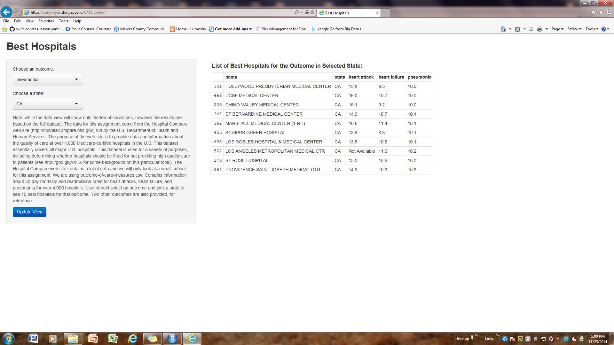

CMS_Shiny
========================================================
author: Sanjiv Vyas
date: 11/23/2014

Find the Best Hospital
========================================================

An analytical approach to identify the Best Hospital in US

- Compare Mortality Rates
- By States
- By Outcome 

Background
========================================================

Hospital Compare web site (http://hospitalcompare.hhs.gov is run 
by the U.S. Department of Health and Human Services. The purpose of the web site is to provide data and information
about the quality of care at over 4,000 Medicare-certifed hospitals in the U.S. This dataset essentially covers all
major U.S. hospitals. This dataset is used for a variety of purposes, including determining whether hospitals should be fined or not providing high quality care to patients (see http://goo.gl/jAXFX for some background on this particular topic).

Website at https://sanjivvyas.shinyapps.io/CMS_Shiny/ is a powerfull tool to identify the Best Hospital among 4000 hospitals for
three outcomes in any states. 
 

Find the Best Hospital using - https://sanjivvyas.shinyapps.io/CMS_Shiny/
========================================================



Read Data file, Select necessary data, Select and Sort
========================================================

Note: In below code select and state would require ui.R input hence commented out


```r
  ## Read outcome data 
  data <- read.csv("outcome-of-care-measures.csv", colClasses = "character") 
  
  
  ## Filter and simplify the column names 
  data <- data[c(2, 7, 11, 17, 23)] 
  names(data)[1] <- "name" 
  names(data)[2] <- "state" 
  names(data)[3] <- "heart attack" 
  names(data)[4] <- "heart failure" 
  names(data)[5] <- "pneumonia" 
  # Return the requested dataset

  ## BELOW CODE IS COMMENTED OUT AS IT REQUIRES PARAMETERS PASSED FROM ui.R

  # Grab only rows with our state value   
    #  df <- data[data$state==input$state, ] 
  # Sort the list for the outcome and return  
   # df <- df[order(df[input$outcomename], decreasing = FALSE), ]
```


